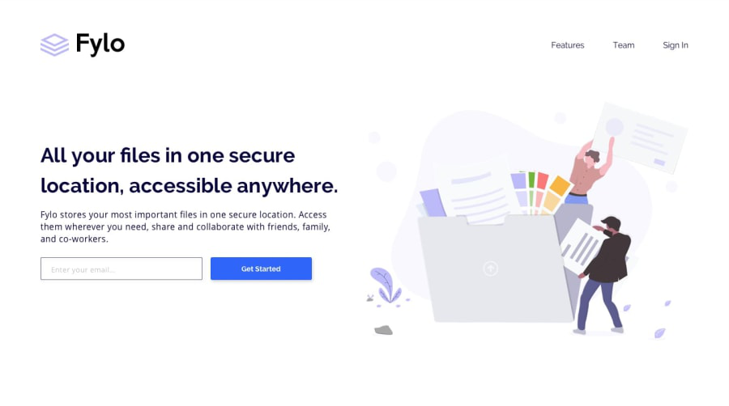

# This is a collaborative design by AltSchool Africa students (Circle-9) inspired by Frontend Mentor
The name of the project will be Circle-9 - A cloud hosting platform

## Welcome! 👋
**To do this challenge, you need a basic understanding of HTML and CSS.**

## The challenge

Your challenge is to build out this landing page and get it looking as close to the design as possible.
As team members we are basically using HTML and CSS for this project and the project will be divided into four part;
============================================================
###1. The Header Section

============================================================

============================================================
###2. Productive Section (2nd Section)
.png)
============================================================

============================================================
###3. Newsletter Section
.png
============================================================

============================================================
###4. Footer Section
.png)
============================================================

## Where to find everything

Your task is to build out the project to the designs inside the `/design` folder. You will find both a mobile and a desktop version of the design. 

The designs are in JPG static format. Using JPGs will mean that you'll need to use your best judgment for styles such as `font-size`, `padding` and `margin`. 

You will find all the required assets in the `/images` folder. The assets are already optimized.

There is also a `style-guide.md` file containing the information you'll need, such as color palette and fonts.

## Building your project

Feel free to use any workflow that you feel comfortable with. Below is a suggested process, but do not feel like you need to follow these steps:

1. Initialize your project as a public repository on [GitHub](https://github.com/). Creating a repo will make it easier to share your code with the community if you need help. If you're not sure how to do this, [have a read-through of this Try Git resource](https://try.github.io/).
2. Configure your repository to publish your code to a web address. This will also be useful if you need some help during a challenge as you can share the URL for your project with your repo URL. There are a number of ways to do this, and we provide some recommendations below.
3. Look through the designs to start planning out how you'll tackle the project. This step is crucial to help you think ahead for CSS classes to create reusable styles.
4. Before adding any styles, structure your content with HTML. Writing your HTML first can help focus your attention on creating well-structured content.
5. Write out the base styles for your project, including general content styles, such as `font-family` and `font-size`.
6. Start adding styles to the top of the page and work down. Only move on to the next section once you're happy you've completed the area you're working on.

## Deploying your project

As mentioned above, there are many ways to host our project for free. Our recommend hosts are:

- [GitHub Pages](https://pages.github.com/)
- [Vercel](https://vercel.com/)
- [Netlify](https://www.netlify.com/)

You can host your site using one of these solutions or any of our other trusted providers. [Read more about our recommended and trusted hosts](https://medium.com/frontend-mentor/frontend-mentor-trusted-hosting-providers-bf000dfebe).

## Got feedback for us?
Kindly reach out to the team member via WhatsApp

This project is completely free. Please share it with anyone who will find it useful for practice.

**Have fun building!** 🚀
